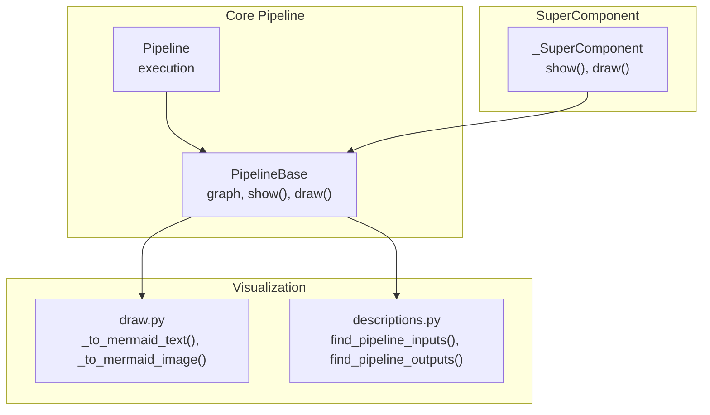
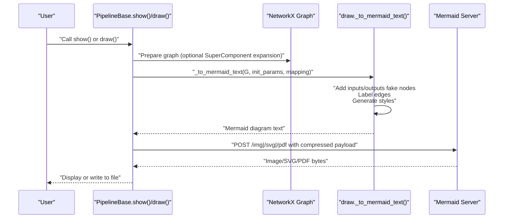
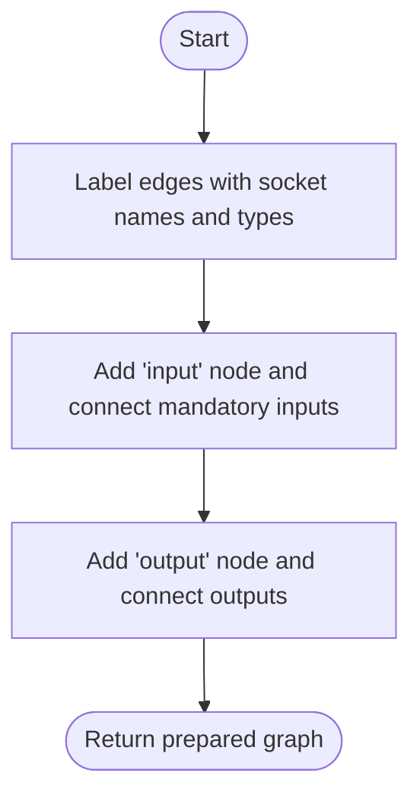
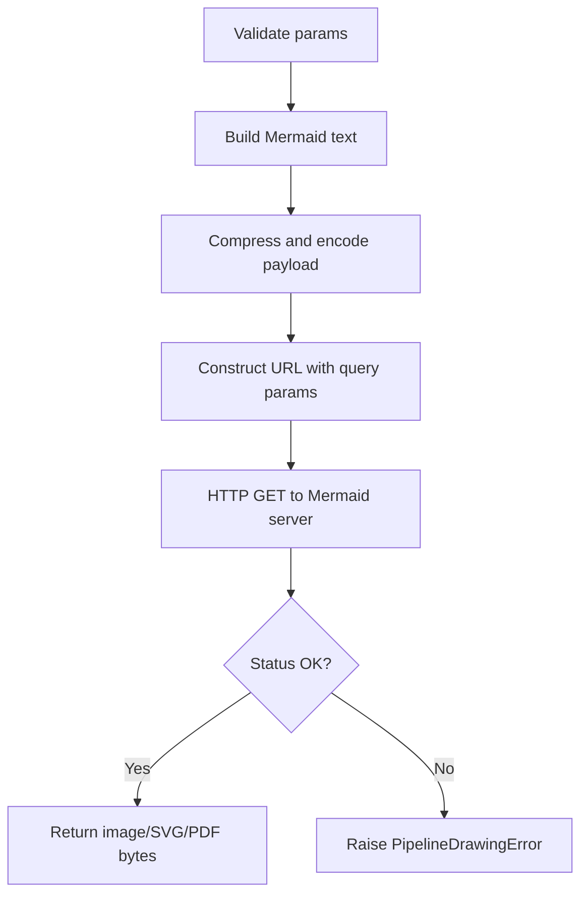
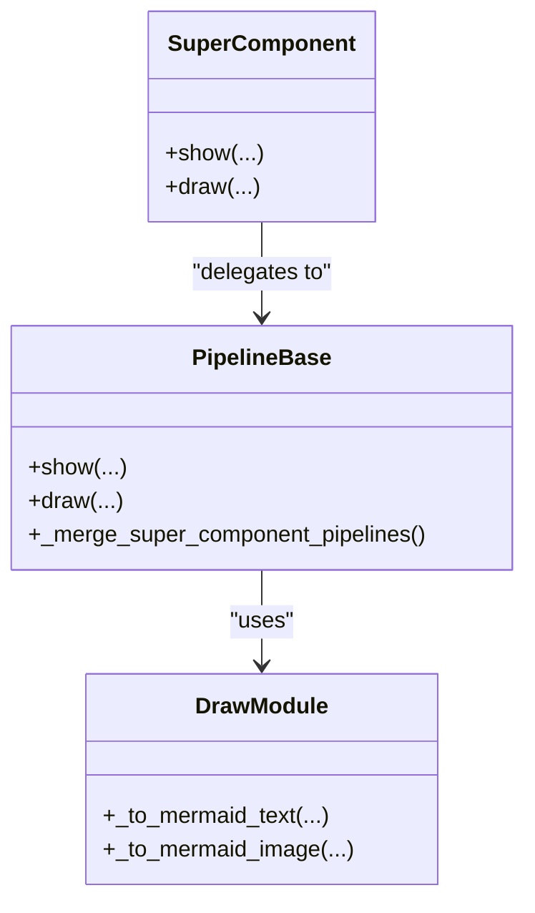
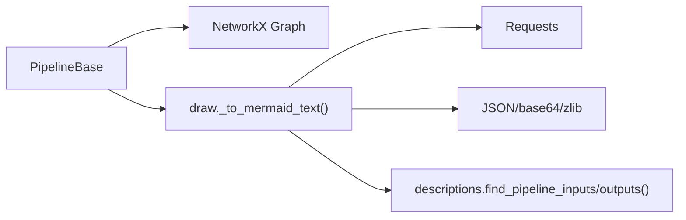

# Pipeline Visualization

<cite>
**Referenced Files in This Document**
- [base.py](file://haystack/core/pipeline/base.py)
- [draw.py](file://haystack/core/pipeline/draw.py)
- [descriptions.py](file://haystack/core/pipeline/descriptions.py)
- [pipeline.py](file://haystack/core/pipeline/pipeline.py)
- [super_component.py](file://haystack/core/super_component/super_component.py)
- [expand-supercomponents-in-draw-show-0d10dbbfc4b1539b.yaml](file://releasenotes/notes/expand-supercomponents-in-draw-show-0d10dbbfc4b1539b.yaml)
- [allow-non-leaf-outputs-in-supercomponents-outputs-adf29d68636c23ba.yaml](file://releasenotes/notes/allow-non-leaf-outputs-in-supercomponents-outputs-adf29d68636c23ba.yaml)
</cite>

## Table of Contents
1. [Introduction](#introduction)
2. [Project Structure](#project-structure)
3. [Core Components](#core-components)
4. [Architecture Overview](#architecture-overview)
5. [Detailed Component Analysis](#detailed-component-analysis)
6. [Dependency Analysis](#dependency-analysis)
7. [Performance Considerations](#performance-considerations)
8. [Troubleshooting Guide](#troubleshooting-guide)
9. [Conclusion](#conclusion)
10. [Appendices](#appendices)

## Introduction
This document explains Haystack’s pipeline visualization system. It covers how pipeline diagrams are generated, how the pipeline is represented as a graph, and how the Mermaid-based rendering works. It documents customization options for styling, node formatting, and edge rendering. It also explains interactive visualization features for exploration and debugging, integration with external visualization tools, and export formats. Finally, it provides guidance on interpreting diagrams, practical examples, and performance considerations for large pipelines and real-time updates.

## Project Structure
The visualization system spans a few core modules:
- Pipeline base and drawing logic
- Graph preparation and Mermaid rendering
- SuperComponent integration for expanded views
- Pipeline execution and input/output discovery

**Diagram sources**
- [base.py](file://haystack/core/pipeline/base.py#L722-L807)
- [draw.py](file://haystack/core/pipeline/draw.py#L172-L354)
- [descriptions.py](file://haystack/core/pipeline/descriptions.py#L12-L43)
- [pipeline.py](file://haystack/core/pipeline/pipeline.py#L35-L453)
- [super_component.py](file://haystack/core/super_component/super_component.py#L490-L558)

**Section sources**
- [base.py](file://haystack/core/pipeline/base.py#L722-L807)
- [draw.py](file://haystack/core/pipeline/draw.py#L172-L354)
- [descriptions.py](file://haystack/core/pipeline/descriptions.py#L12-L43)
- [pipeline.py](file://haystack/core/pipeline/pipeline.py#L35-L453)
- [super_component.py](file://haystack/core/super_component/super_component.py#L490-L558)

## Core Components
- PipelineBase: Provides the graph model and visualization entry points (show and draw). It supports optional expansion of SuperComponent internals into the diagram.
- draw.py: Converts the NetworkX graph into Mermaid syntax, validates rendering parameters, and renders via a Mermaid server.
- descriptions.py: Utility functions to discover pipeline inputs and outputs for diagram generation.
- SuperComponent: Wraps a Pipeline and exposes show/draw methods that delegate to the underlying pipeline, optionally expanding SuperComponent internals.

Key responsibilities:
- Graph representation: NetworkX MultiDiGraph storing components and typed edges.
- Diagram generation: Mermaid text generation with optional SuperComponent expansion and color coding.
- Rendering: HTTP requests to a Mermaid server with compression and query parameters.
- Customization: Theme, format, dimensions, and PDF options.

**Section sources**
- [base.py](file://haystack/core/pipeline/base.py#L722-L807)
- [draw.py](file://haystack/core/pipeline/draw.py#L61-L90)
- [draw.py](file://haystack/core/pipeline/draw.py#L109-L171)
- [draw.py](file://haystack/core/pipeline/draw.py#L172-L256)
- [draw.py](file://haystack/core/pipeline/draw.py#L259-L354)
- [descriptions.py](file://haystack/core/pipeline/descriptions.py#L12-L43)
- [super_component.py](file://haystack/core/super_component/super_component.py#L490-L558)

## Architecture Overview
The visualization pipeline transforms a Haystack pipeline graph into a Mermaid diagram and renders it via a Mermaid server.

**Diagram sources**
- [base.py](file://haystack/core/pipeline/base.py#L722-L807)
- [draw.py](file://haystack/core/pipeline/draw.py#L172-L256)
- [draw.py](file://haystack/core/pipeline/draw.py#L259-L354)

## Detailed Component Analysis

### PipelineBase Visualization Methods
- show(): Renders and displays the pipeline diagram inside a Jupyter notebook. Supports optional SuperComponent expansion and passes Mermaid parameters to the renderer.
- draw(): Saves the diagram to a local file path using the same rendering pipeline.

Behavior highlights:
- Optional SuperComponent expansion merges internal components into the main graph for detailed visualization.
- Uses a Mermaid server URL and a params dictionary for customization.
- Raises errors when used outside Jupyter for show().

Practical usage:
- Call show() in a notebook to preview the diagram.
- Call draw(Path(...)) to export an image.

**Section sources**
- [base.py](file://haystack/core/pipeline/base.py#L722-L788)
- [base.py](file://haystack/core/pipeline/base.py#L789-L807)

### Graph Preparation and Edge Labeling
- Adds “input” and “output” fake nodes to represent pipeline boundaries.
- Labels edges with socket names and types, and marks optional connections.
- Discovers pipeline inputs and outputs to connect boundary nodes.

**Diagram sources**
- [draw.py](file://haystack/core/pipeline/draw.py#L61-L90)
- [descriptions.py](file://haystack/core/pipeline/descriptions.py#L12-L43)

**Section sources**
- [draw.py](file://haystack/core/pipeline/draw.py#L61-L90)
- [descriptions.py](file://haystack/core/pipeline/descriptions.py#L12-L43)

### Mermaid Rendering and Parameter Validation
- Validates parameters for format, theme, dimensions, scale, and PDF options.
- Generates Mermaid text with class definitions for SuperComponent color coding.
- Compresses and base64-encodes the Mermaid payload and sends it to the Mermaid server endpoint.
- Supports img, svg, and pdf formats with query parameters.

**Diagram sources**
- [draw.py](file://haystack/core/pipeline/draw.py#L109-L171)
- [draw.py](file://haystack/core/pipeline/draw.py#L172-L256)

**Section sources**
- [draw.py](file://haystack/core/pipeline/draw.py#L109-L171)
- [draw.py](file://haystack/core/pipeline/draw.py#L172-L256)

### SuperComponent Expansion and Styling
- When enabled, the main graph is expanded to include internal components of SuperComponents, replacing the black-box representation with the actual internal structure.
- Internal components are colored distinctly by SuperComponent to improve readability.
- SuperComponent.show() and draw() delegate to the underlying pipeline’s visualization methods.

**Diagram sources**
- [base.py](file://haystack/core/pipeline/base.py#L1438-L1453)
- [draw.py](file://haystack/core/pipeline/draw.py#L259-L354)
- [super_component.py](file://haystack/core/super_component/super_component.py#L490-L558)

**Section sources**
- [base.py](file://haystack/core/pipeline/base.py#L1438-L1453)
- [draw.py](file://haystack/core/pipeline/draw.py#L293-L304)
- [super_component.py](file://haystack/core/super_component/super_component.py#L490-L558)
- [expand-supercomponents-in-draw-show-0d10dbbfc4b1539b.yaml](file://releasenotes/notes/expand-supercomponents-in-draw-show-0d10dbbfc4b1539b.yaml#L1-L5)

### Visualization Customization Options
Supported Mermaid parameters:
- format: img, svg, pdf
- type: png, jpeg, webp (when format=img)
- theme: default, neutral, dark, forest
- bgColor: background color
- width, height: numeric dimensions
- scale: numeric scaling factor (requires width or height)
- fit: boolean (PDF fit to page)
- paper: paper size (e.g., a4, a3) (ignored if fit=true)
- landscape: boolean (PDF landscape) (ignored if fit=true)

Validation ensures correctness and logs warnings for conflicting PDF options.

**Section sources**
- [draw.py](file://haystack/core/pipeline/draw.py#L109-L171)

### Interactive Visualization Features
- Jupyter integration: show() renders inline in notebooks.
- Real-time updates: regenerate diagrams after editing the pipeline (adding/removing/connecting components).
- SuperComponent expansion: toggle to reveal internal structure for debugging nested pipelines.

**Section sources**
- [base.py](file://haystack/core/pipeline/base.py#L722-L788)
- [super_component.py](file://haystack/core/super_component/super_component.py#L490-L558)

### Interpretation Guide for Pipeline Diagrams
- Nodes: Components with optional inputs listed below the component name.
- Edges: Typed connections labeled with socket names and types; optional edges are visually distinguished.
- Boundaries: “input” and “output” nodes indicate pipeline entry/exit points.
- SuperComponent expansion: Internal components are shown with distinct styles to clarify ownership.

Practical tips:
- Use the legend to identify SuperComponent color groups.
- Optional inputs are highlighted to help spot default-driven flows.
- For complex pipelines, enable SuperComponent expansion to understand nested logic.

**Section sources**
- [draw.py](file://haystack/core/pipeline/draw.py#L259-L354)
- [descriptions.py](file://haystack/core/pipeline/descriptions.py#L12-L43)

### Practical Examples
- Basic visualization in a notebook:
  - Build a pipeline, then call show() to render inline.
- Export to file:
  - Call draw(Path("my_pipeline.png")) to save an image.
- Customize appearance:
  - Pass params with theme, bgColor, width, height, and format.
- Expand SuperComponent internals:
  - Use super_component_expansion=True in show()/draw() to reveal internal structure.

Note: These steps leverage the documented methods and parameters.

**Section sources**
- [base.py](file://haystack/core/pipeline/base.py#L722-L807)
- [draw.py](file://haystack/core/pipeline/draw.py#L109-L171)
- [super_component.py](file://haystack/core/super_component/super_component.py#L490-L558)

## Dependency Analysis
The visualization system depends on:
- NetworkX for graph representation and manipulation
- Requests for HTTP communication with the Mermaid server
- JSON and base64/zlib for payload encoding and compression
- Haystack’s pipeline input/output discovery utilities

**Diagram sources**
- [base.py](file://haystack/core/pipeline/base.py#L722-L807)
- [draw.py](file://haystack/core/pipeline/draw.py#L172-L256)
- [descriptions.py](file://haystack/core/pipeline/descriptions.py#L12-L43)

**Section sources**
- [base.py](file://haystack/core/pipeline/base.py#L722-L807)
- [draw.py](file://haystack/core/pipeline/draw.py#L172-L256)
- [descriptions.py](file://haystack/core/pipeline/descriptions.py#L12-L43)

## Performance Considerations
- Large pipelines:
  - Prefer exporting to SVG for scalable vector graphics when high fidelity is needed.
  - Limit unnecessary SuperComponent expansion for very large graphs to reduce visual clutter.
- Rendering overhead:
  - Compression and base64 encoding add CPU cost; cache results when regenerating frequently.
  - Use smaller width/height or scale judiciously to balance readability and render time.
- Real-time updates:
  - Re-render only when the graph changes; debounce frequent calls in interactive environments.
- Network reliability:
  - Configure appropriate timeouts and handle transient failures gracefully.

[No sources needed since this section provides general guidance]

## Troubleshooting Guide
Common issues and resolutions:
- Calling show() outside Jupyter:
  - Use draw() to save images locally instead.
- Invalid Mermaid parameters:
  - Ensure format, theme, and dimension values conform to supported sets; check warnings for conflicting PDF options.
- Network errors:
  - Verify the Mermaid server URL and connectivity; adjust timeout if needed.
- SuperComponent expansion anomalies:
  - Confirm that the pipeline contains SuperComponents; ensure the expansion flag is set appropriately.

**Section sources**
- [base.py](file://haystack/core/pipeline/base.py#L768-L787)
- [draw.py](file://haystack/core/pipeline/draw.py#L109-L171)
- [draw.py](file://haystack/core/pipeline/draw.py#L236-L256)

## Conclusion
Haystack’s pipeline visualization system provides a robust, customizable way to render pipeline diagrams using Mermaid. It supports interactive exploration in notebooks, export to multiple formats, and advanced features like SuperComponent expansion. By leveraging the documented APIs and parameters, users can effectively understand execution flow, component relationships, and data dependencies, and tailor visuals to their needs.

[No sources needed since this section summarizes without analyzing specific files]

## Appendices

### API Summary
- PipelineBase.show(server_url, params, timeout, super_component_expansion)
- PipelineBase.draw(path, server_url, params, timeout, super_component_expansion)
- SuperComponent.show(server_url, params, timeout)
- SuperComponent.draw(path, server_url, params, timeout)

Supported params include format, type, theme, bgColor, width, height, scale, fit, paper, and landscape.

**Section sources**
- [base.py](file://haystack/core/pipeline/base.py#L722-L807)
- [super_component.py](file://haystack/core/super_component/super_component.py#L490-L558)
- [draw.py](file://haystack/core/pipeline/draw.py#L109-L171)